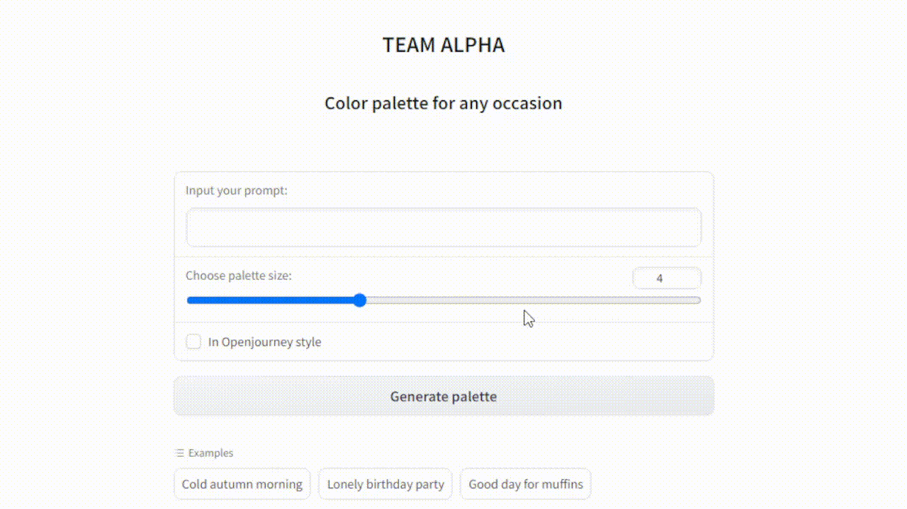

# team_alpha
Проект по дисциплине "Программная инженерия".

## Состав команды:
* [Фарафонов Данил](https://github.com/DanilFarafonov) - Тимлид, развертывание приложения на платформе Яндекс.Облако
* [Семерикова Ксения](https://github.com/lisxen) - Разработка тестов и настройка github actions
* [Середкина Елизавета](https://github.com/stibiumghost) - Разработка дизайна и функциональности приложения

## Описание приложения
Цель данного приложения - генерация цветовой палитры по заданным размеру и текстовому описанию.

Алгоритм работы:
1. Ввод текста, описывающего идею пользователя;
2. Выбор размера будущей палитры;
3. Генерация изображения по введенному описанию с помощью модели [openjourney](https://huggingface.co/prompthero/openjourney);
4. Генерация палитры на основе полученного изображения (используется метод К-средних). В палитру вносятся самые часто встречающиеся цвета на изображении в порядке убывания.  Используемый [ресурс](github.com/mushahidq/py_colour_identifier/blob/main/colour_identifier.ipynb);
5. Вывод полученных цветов с их HEX-кодом.

## Пример работы приложения:

